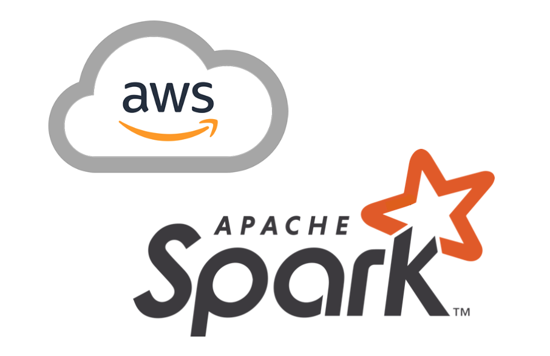

# Cloud Computing with Spark

[](LICENSE)  

This project aims to present the use of Spark to carry out distributed training in the cloud with AWS.  

## Description  

Apache Spark is an open-source framework developed by the AMPLab at UC Berkeley for processing massive databases using distributed computing, a technique which consists of exploiting several computing units distributed in clusters for the benefit of a single project in order to to divide the execution time of a query. Spark was developed in Scala and is at its best in its native language. However, the PySpark library offers to use it with the Python language, keeping performance similar to Scala implementations. Pyspark is a good alternative to the pandas library when you want to process data sets that are too large and result in calculations that are too time-consuming.<br>
<br>
In this project, we present the architecture and deployment method of Spark in a Cloud environment with Amazon Web Service.


#### You can download data from this [link](https://s3.eu-west-1.amazonaws.com/course.oc-static.com/projects/Data_Scientist_P8/fruits.zip)


## Table of Contents

- [Getting Started](#Getting-Started)
- [Contributing](#Contributing)
- [License](#License)

## Getting Started  

```bash
git clone https://github.com/HaDock404/ai-cloud-computing-spark.git
cd ai-cloud-computing-spark
pip install -r ./train/packages/requirements.txt
open ./train/local_notebook.ipynb
```  

## Contributing

Pull requests are welcome. For major changes, please open an issue first
to discuss what you would like to change.

Please make sure to update tests as appropriate.

## License  

This project is licensed under the MIT License - see the [LICENSE](./LICENSE) file for details.